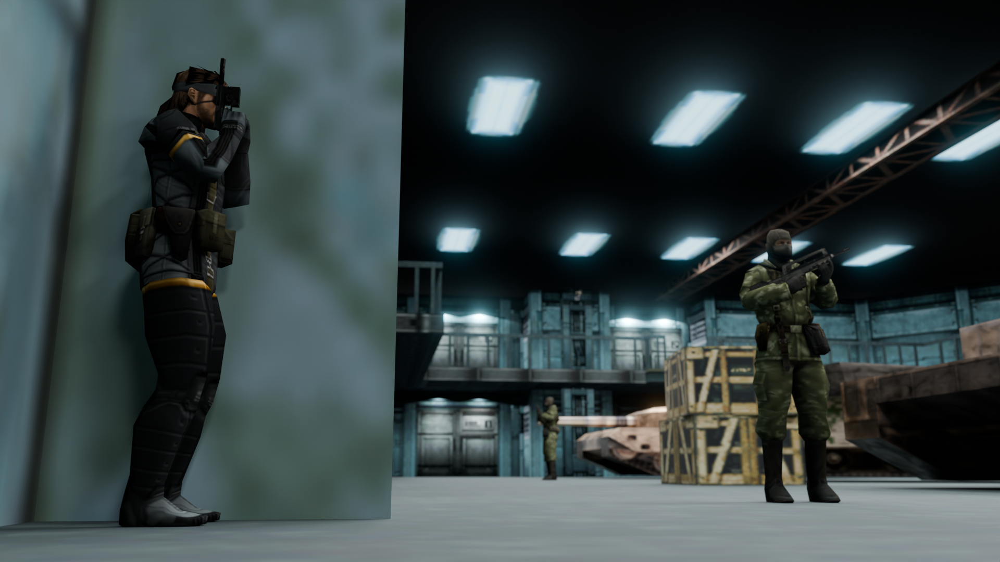
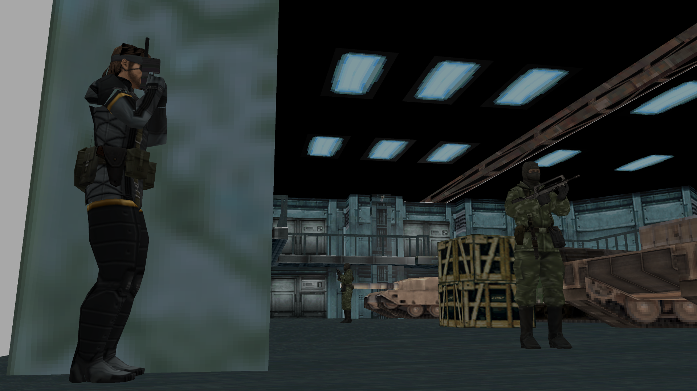
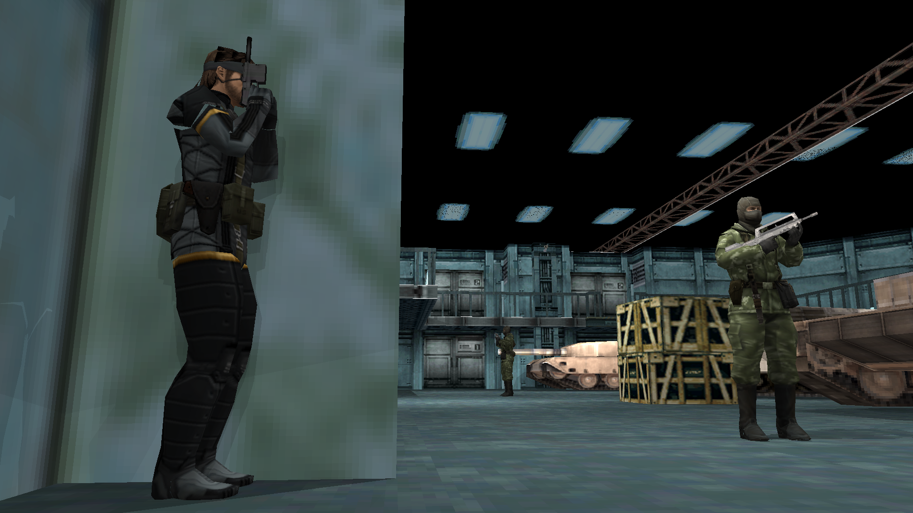

# Computer Graphics

This project focused on creating three images using three different rendering techniques: path tracing, rasterisation, and ray tracing.

## Pathtraced

## Rasterised

## Raytraced

